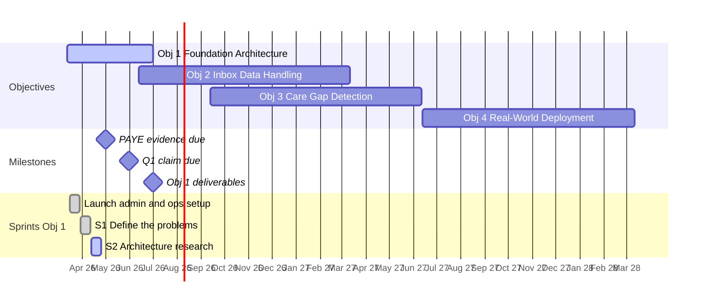

# NexWave Health

## Projects

```dataviewjs
const active = dv.pages('"areas/nexwave-rd/projects"')
  .where(p => p.dashboard == "nexwave-rd" && p.status != "parked")
  .sort(p => p.title ?? p.file.name);
for (let p of active) {
  const badge = p.status == "production" ? "🟢" : "🔵";
  const taskCount = dv.pages('"areas/nexwave-rd/tasks/open"').where(t => (t.project === p.id || t.project === "nexwave-rd") && t.status !== "done").length;
  const phase = p.phase ? `\n  _${p.phase}_` : "";
  dv.paragraph(`${badge} [[${p.file.name}|${p.title ?? p.file.name}]] · ${p.description ?? ""} · **${taskCount} open**${phase}`);
}
```

---

**NexWave Health** is the MBIE-funded R&D programme of NexWave Solutions Limited, working to determine whether AI can achieve clinical-grade performance for two core GP workflow problems: **Inbox Helper** (triaging lab results, discharge summaries, and clinical correspondence by urgency) and **Care Gap Finder** (identifying patients overdue for diabetes and cardiovascular risk management). The founder is a practising GP and full-stack developer, bringing direct clinical domain knowledge to the research. NexWave Health has a formal partnership with Medtech (NZ's largest PMS provider, ~60% market share), giving real-world integration access. The ultimate goal is NZ-sovereign clinical AI — built and operated within NZ under Privacy Act constraints, not dependent on overseas cloud infrastructure. Success would free an estimated 900,000 GP hours per year across the NZ workforce.

**Signed contract:** [CONT-109091-N2RD-NSIWKC — Funding Agreement (signed 25 Mar 2026)](https://drive.google.com/file/d/1P_le7IGb8EyQtnNIJYLwfjKmeAKmU-_w/view?usp=drivesdk) — filed in Google Drive: R&D / Grant archive

**Context files:** [Grant Application](../nexwave-rd/docs/programme/application-verbatim.md) | [Grant Compliance Guide](../nexwave-rd/docs/programme/compliance-guide.md) | [Competitor Tracker](../nexwave-rd/docs/programme/competitor-tracker.md) | [Glossary](../nexwave-rd/docs/programme/glossary.md)

---

## Quick Links

| | |
|--|--|
| **Objective 1** | [[nexwave-rd-obj-1]] |
| **Active sprint** | [[2026-04-rd-sprint-1]] |
| **Grant compliance** | [Grant Compliance Guide](../nexwave-rd/docs/programme/compliance-guide.md) |
| **Grant application** | [Grant Application](../nexwave-rd/docs/programme/application-verbatim.md) |
| **Competitor tracker** | [Competitor Tracker](../nexwave-rd/docs/programme/competitor-tracker.md) |
| **Glossary** | [NexWave / R&D Glossary](../nexwave-rd/docs/programme/glossary.md) |
| **Repo map** | [[repos]] |

---

## Programme at a Glance

| Field | Detail |
| --- | --- |
| Programme brand | NexWave Health (legal entity: NexWave Solutions Limited) |
| Contract ref | CONT-109091-N2RD-NSIWKC |
| Application ref | PROP-109091-N2RD-NSIWKC |
| Grant scheme | New to R&D (N2RD) — MBIE |
| Total eligible costs | $716,926.00 (GST excl.) |
| MBIE funding (40%) | $286,770.40 |
| Required co-funding (60%) | $430,155.60 |
| Contract start | 12 March 2026 |
| Contract end | 11 March 2028 |
| MBIE contact | Lisa Pritchard (MBIE Innovation Services) |
| Q1 claim due | 31 May 2026 (PAYE evidence due 30 Apr 2026) |

**Co-funding sources (approved):**
- GP clinical income: $11,117/month
- Opening bank balance: $111,477.62
- Term deposit: $30,270.87 (matured March 2026)
- Ting shareholder reserve: $100,000 available ($35,000 drawn Month 12)

---

## Current Phase — Objective 1

**Status:** Active | **Period:** Months 1–6 (March–June 2026) | **Budget:** $177,396

Pick the right AI architecture that works for NZ GPs under sovereignty rules, and prove it works on synthetic data by end of June 2026.

See [[nexwave-rd-obj-1]] for full detail — goals, execution roadmap, deliverables, and sprints.

---

## Programme Timeline



```dataviewjs
function attachZoom() {
  document.querySelectorAll('.mermaid:not([data-zoom-bound])').forEach(el => {
    el.setAttribute('data-zoom-bound', '1');
    el.style.cursor = 'zoom-in';
    el.addEventListener('click', () => {
      const svg = el.querySelector('svg');
      if (!svg) return;
      const overlay = document.createElement('div');
      overlay.className = 'mermaid-zoom-overlay';
      const box = document.createElement('div');
      box.className = 'mermaid-zoom-box';
      const clone = svg.cloneNode(true);
      clone.removeAttribute('width');
      clone.removeAttribute('height');
      clone.style.cssText = 'width: 100% !important; height: auto !important; max-width: none !important; display: block;';
      box.appendChild(clone);
      overlay.appendChild(box);
      overlay.addEventListener('click', () => overlay.remove());
      document.body.appendChild(overlay);
    });
  });
}
attachZoom();
const obs = new MutationObserver(attachZoom);
obs.observe(document.body, { childList: true, subtree: true });
setTimeout(() => obs.disconnect(), 8000);
```

---

## Objective Timeline

| Objective | Title | Period | Status |
|---|---|---|---|
| [[nexwave-rd-obj-1\|Obj 1]] | Foundation AI Architecture | Months 1–6 (Mar–Jun 2026) | Active |
| Obj 2 | Real-World Inbox Data Handling | Months 4–12 (Jun 2026–Mar 2027) | Not Started |
| Obj 3 | Care Gap Detection Validation | Months 7–16 (Sep 2026–Jun 2027) | Not Started |
| Obj 4 | Real-World Deployment | Months 16–24 (Jun 2027–Mar 2028) | Not Started |

---

## Budget by Objective

| Objective | Budget |
|---|---|
| Obj 1 — Foundation Architecture | $177,396 |
| Obj 2 — Inbox Data Handling | $178,562 |
| Obj 3 — Care Gap Detection | $179,410 |
| Obj 4 — Real-World Deployment | $145,558 |
| Capability Development | $36,000 |
| **Total** | **$716,926** |

---

## Capability Development

Three areas selected. All must be completed by 11 March 2028. Non-completion = clawback.

| Area | Budget | Period | What MBIE expects |
|---|---|---|---|
| Regulatory & Compliance | $18,000 | Feb 2026–Jul 2027 | Gap analyses, DPIA methodology, compliance frameworks — not just consultant invoices |
| R&D Information Management | $10,000 | Feb–Sep 2026 | Working experiment tracking system, model registry, dataset lineage by Sep 2026 |
| Project Management | $8,000 | Feb 2026–Jun 2027 | Budget tracking, risk register, roadmaps, Ting demonstrably leading R&D programme management |

See tasks in the NexWave R&D Tasks database.

---

## Regulatory & Compliance

$18,000 Capability Development line (Feb 2026–Jul 2027). Gap analyses, DPIA methodology, compliance frameworks. Related task: [[rd-20260415-002]].

Full detail, compliance landscape, sequencing guidance, and firm proposals: [[nexwave-rd-compliance]]

| Firm | Status | Next action |
|---|---|---|
| Bell Gully | On hold | Fallback only — do not instruct until Buddle Findlay Phase 1 scoped |
| Buddle Findlay | **Selected — primary partner** | Draft email to Catherine Miller — rd-20260423-002, due 27 Apr |
| Elevate Medtech | Discontinued 23 Apr | Technical consultant only, not legal counsel |
| Aesculytics | No response | Deprioritised |

---

## Critical Deadlines

| Deadline | Date | Notes |
|---|---|---|
| PAYE evidence for Ting | **30 April 2026** | Hard contract condition — MBIE blocks all employee-related claims until received. Payslip or employment agreement accepted. |
| Q1 claim + invoice | **31 May 2026** | First mandatory quarterly claim. Progress report + cost spreadsheet + GST invoice. |
| Q2 claim | ~30 Jun 2026 | Period: 12 Mar–11 Jun 2026 |
| Q3 claim | ~30 Sep 2026 | Period: 12 Jun–11 Sep 2026 |
| Q4 claim | ~31 Dec 2026 | Period: 12 Sep–11 Dec 2026 |
| Q5 claim | ~31 Mar 2027 | Period: 12 Dec 2026–11 Mar 2027 |
| Q6 claim | ~30 Jun 2027 | Period: 12 Mar–11 Jun 2027 |
| Q7 claim | ~30 Sep 2027 | Period: 12 Jun–11 Sep 2027 |
| Q8 claim | ~31 Dec 2027 | Period: 12 Sep–11 Dec 2027 |
| Final claim + report | **11 June 2028** | No later than 3 months after contract end. Miss this = MBIE not liable to pay. |
| Financial statements | Upon request | At end of each FY during grant period and for 2 years after |

---

## Contract Conditions

### PAYE Evidence — Due 30 April 2026

MBIE will not fund any work by internal employees until payslip or employment agreement is provided for each team member listed in the approved Cost Template. One-off requirement per team member, due before or with first claim.

**Action:** Submit Ting's payslip or employment agreement via MBIE portal before 30 April 2026.

### Quarterly Claim Requirements

> **Contract condition, not just admin.** Missing the quarterly claim is a potential breach of agreement. If the report is not received, MBIE is not obliged to make payment.

Each claim must include:

- Progress report (via MBIE online portal)
- Excel cost spreadsheet against approved Cost Template
- GST invoice
- Supporting invoices for any expense over NZ$2,500
- All international invoices (regardless of value)
- Bank statement proof for any foreign currency payments
- Any matters affecting ability to complete R&D or Capability Development

---

## Key Contract Terms

### Change of Control (clause 9.1b)
Any event resulting in someone acquiring >50% of voting shares, board control, or majority benefit requires **prior written consent from MBIE**. Notify MBIE before any investor or restructure discussion reaches this threshold.

### Co-funding Rule (clauses 3.3–3.4)
Your 60% co-funding ($430,155.60) must not come from any public sector agency or entity. If co-funding drops below 60% at any time, it is a Change Event — notify MBIE immediately.

### Records Retention (clause 6.4)
All records relating to funding use must be kept for **7 years** from expiry or termination. Includes all invoices, timesheets, and supporting documentation.

### Publicity (clause 21.4)
- Any media release mentioning MBIE or quoting their staff: 48 hours prior written approval required.
- Any public statement about your R&D must reference the N2RD Grant Scheme.
- Notify MBIE of any media enquiries about funded R&D.

### MBIE Termination Right (clauses 12.2–12.3)
MBIE can terminate with 10 business days notice for any reason. The grant is not guaranteed for the full 24 months.

### IP in Reports (clause 6.5)
IP in progress reports submitted to MBIE is owned by MBIE from date of creation. Your R&D output IP remains yours.

### R&D Must Be in NZ (Schedule)
Unless expressly permitted in your approved Cost Template, R&D undertaken outside New Zealand is not eligible.

---

## Clawback Triggers

You must repay all or part of funding if:

- Capability Development activities not completed by end of grant period
- Funding misappropriated or misused
- Incorrect information provided
- Claims submitted for ineligible expenses
- Agreement terminated
- Change of Control that reduces NZ R&D capability (clause 13.1g)
- Co-funding falls below 60% of total eligible costs

**Operational hard stops:**

- Safety metrics fail → halt all deployment immediately
- Clinical accuracy drops >10% → investigate before proceeding
- GP satisfaction <60% → re-evaluate workflow integration

---

## Tax Treatment

> Researched 25 Mar 2026. Pending confirmation from Helen Yu (accountant) before Q1 claim.

| Tax | Treatment |
|---|---|
| GST | Output tax required on each reimbursement — return 15/115 of reimbursement amount to IRD (s5(6D) GST Act). Each claim must include a GST invoice. |
| Income tax | Reimbursements non-taxable (s CX47 ITA) — do not include in income tax return. |
| Deductions | 40% of salary costs non-deductible (s DF1 ITA). Remaining 60% fully deductible. Net effect: tax neutral. |

Example: $10,000 reimbursement = $8,695.65 income + $1,304.35 GST payable to IRD.

---

## Key Contacts

| Person | Role | Contact |
|---|---|---|
| Lisa Pritchard | MBIE Innovation Services contact | Via Forge portal |
| Ting | R&D Programme Manager (full-time, 40hrs/week) | Internal |
| Helen Yu | Accountant (all entities) — see [people.md](../context/people.md#helen-yu) for scope | helen@hscg.co.nz |

---

## Payroll

Payroll software: Xero. Paid monthly in arrears. PAYE deducted at source.

| | Ryo | Ting |
|---|---|---|
| Annual salary | $124,800.00 | $121,326.40 |
| Monthly gross | $10,400.00 | $10,110.53 |
| MBIE hourly rate (cost template) | $80.00/hr | $58.33/hr |
| MBIE eligible hourly rate (incl. 20% overhead) | $96.00/hr | $70.00/hr |
| Hours/week on R&D | 30 | 40 |

> **Status (16 Apr 2026):** First pay run executed 16 April (period 16 Mar–15 Apr). Ryo net $7,629.57, Ting net $7,440.68, PAYE $5,440.28 due 20 May. Auto-payment set up for monthly 16th. Corrected employment agreement emailed to Ting 15 April for re-signature; signed copy due 20 April. Signed contract + payslip to be uploaded to MBIE portal before 30 April. Tracked in rd-20260415-001 (Ting signature) and rd-20260404-001 (MBIE submission).
>
> **Status (20 Apr 2026):** PAYE condition submitted to Forge portal. Uploaded: Monthly Pay Summary (IRD, 16 Apr pay run), ryo-employment-contract-final.pdf, ting-employment-contract-final.pdf. Notes field stated Developer role unfilled; evidence to follow when hired. Condition gate cleared ahead of 30 Apr deadline. rd-20260420-001 done.
>
> **Contract salary discrepancy (action required before Q1 claim):** Payroll is running at MBIE Cost Template hourly rates (Ryo $80/hr × 30hrs = $10,400/mo; Ting $58.33/hr × 40hrs = $10,110.53/mo), which is correct for grant purposes. However, the stated annual salaries in both employment contracts do not match these figures (contracts show $140,160 and $102,194.16 respectively). Helen needs to issue corrected contracts with annual salaries that reconcile to the actual payroll rates before the Q1 claim.

### Operating rules (learnt)

- **Cross-check every contract rate against the approved MBIE Cost Template before signing.** Helen's first draft of Ting's contract came in at $48.94/hr; MBIE approved rate is $58.33/hr. Discrepancy would have been locked into MBIE submission and triggered a compliance issue if not caught. Applies to any future rate change or new employee.
- **Payroll responsibility split:** Helen runs Xero payroll + files PAYE with IRD; Ryo executes bank transfers on pay day. PAYE liability for a given pay period is due the 20th of the following month (April pay → 20 May). One pay run per month, 16th of month, covering previous 16th–15th.
- **Helen's scope (all entities)** lives in `context/people.md`. Do not duplicate the scope block here. Financial only, not a PA. For the R&D stream specifically: Helen produces the MBIE quarterly cost reports from Xero, but Ryo does the MBIE submission itself and all programme documentation.

---

## Open Questions

| # | Question | Category | Priority |
|---|---|---|---|
| Q1 | What synthetic NZ clinical data sources to use before real data is available? | Technical | High |
| Q2 | What is the medical device software classification for assist-only AI under NZ Medsafe framework? | Regulatory | High |
| Q3 | What is the current status of the Medical Products Bill — does it apply during the grant period? | Regulatory | High |
| Q4 | How to structure the ground truth annotation process for 500–1,000 inbox items? | Technical | High |
| Q5 | Reporting cadence and format required by MBIE for Q1 — confirm with Lisa Pritchard | Programme | High |
| Q6 | What does the GP-facing UI look like for reviewing AI triage suggestions? | Product | Medium |
| Q7 | How does the system handle a case where AI confidence is below the auto-action threshold? | Product | Medium |
| Q8 | Which GP annotators to recruit for inter-rater reliability study? | Technical | Medium |
| Q9 | What is the exact MVP scope for Inbox Helper to release during Obj 2? | Product | Medium |

*Resolved: Which AI architecture to evaluate first (→ Llama/RAG stack on Runpod); Which payroll software (→ Xero)*

---

## Weekly Progress Log

AI-maintained weekly log. Primary audit trail for MBIE claims. Hours: Ryo ~30hrs (Sat/Sun), Ting 40hrs (Mon–Fri).

### Week of 16 March 2026

- Employment contract drafted and signed
- Medtech R&D meeting — agreed on R&D scope post-grant approval
- LLM/RAG/fine-tuning initial research (in progress)
- PAYE setup completed

### Week of 23 March 2026

- R&D operations system designed (Notion task/goal structure, reporting workflow)
- Continued LLM/RAG/fine-tuning research (in progress)
- Tasks underway: Medtech sandbox documentation, Indici contact search, literature review

### Week of 30 March 2026

- Sprint 1 kicked off (Objective 1 Step 1: define the problems clearly)
- Sprint goals restructured to enforce sequential dependencies across the 5-step Objective 1 roadmap
- Inbox Helper task specification drafted — urgency taxonomy, document-type classification criteria, boundary cases, output schema, success criteria, test set design

### Week of 12 April 2026

- Compliance consultant outreach complete: three firms responded to 8 April emails — Catherine Miller (Buddle Findlay), Anne Arndt (Elevate Medtech), David Smyth (CARSL); CARSL noted as less relevant (device sponsorship/registration focus only); Buddle Findlay and Elevate Medtech both warm and suitable; email-based scoping to proceed (no calls)
- RNZCGP clinical input channel: Heidi Bubendorfer referred request to Policy and Insight team, awaiting callback
- Gareth Roberts (Comprehensive Care PHO): GP Clinical Review Brief sent 9 April; Gareth offered to circulate within his network
- Payroll confirmed: monthly gross salaries sent to Helen Yu (Ryo $11,680/mo, Ting $8,516.18/mo); first pay run 16 Mar–15 Apr, pay date 16 Apr
- Xero bank account connected; bank feed active
- KiwiSaver savings suspension: apply via myIR after Apr 16 first pay run (both Ryo and Ting)
- Ting employment contract rate discrepancy identified ($48.94 vs MBIE cost template $58.33); correction to be issued by Helen — task rd-20260413-001
- Ting employment contract corrected by Helen ($58.33/hr, $102,194.16 annual); PDF emailed to Ting for re-signature, due 20 April — rd-20260413-001 closed; rd-20260415-001 awaiting signed copy
- Xero bank feed connected — rd-20260413-002 closed
- Payroll process clarification requested from Helen ahead of 16 April first pay run (net amounts to Ryo/Ting, PAYE to IRD, Xero responsibilities)
- Sprint 2 synthesis deliverables (Docs 1–4) completed and filed in `nexwave-rd/docs/obj-1/output/`: literature review, architecture shortlist with decision record, data requirements, synthetic dataset schema (provisional pending GP review). Tasks closed: rd-20260329-003, -010, -011, -022
- Goal B architecture decision recorded: C3 (rules engine + BioClinical ModernBERT 396M / Llama 3.1 8B LoRA hybrid) primary, C1 (Bedrock Claude Haiku 4.5 + Sonnet 4.6) parallel reference; C2 and C4 deferred. Bake-off to conclude before Q1 MBIE claim 31 May 2026
- Synthetic dataset schema v0.1: 400 items, 5×4 stratification grid (25/75/180/120), 15–20% stress items targeting NHS 6:1 contextual reasoning failure pattern, 14 QA gates, 2-stage release (v0.1 provisional → v1.1 stable post rd-20260405-001)
- `nexwave-rd/CLAUDE.md` cleaned: unratified Inbox triage / data-residency architecture lines removed pending decision sign-off
- Compliance consultant outreach expanded to four firms: Elevate Medtech (Anne Arndt), Buddle Findlay (Catherine Miller), Aesculytics (Dr Arindam Bose), Bell Gully (Dr Laura Hardcastle + Kirsty Dobbs) — awaiting initial assessments and indicative costs — rd-20260415-002 tracking
- First NexWave pay run scheduled 16 April (covering 16 Mar–15 Apr): Helen runs Xero payroll + IRD filing; Ryo executes bank transfers on the day — rd-20260415-003 created
- First pay run executed 16 April: Ryo net $7,629.57, Ting net $7,440.68, PAYE $5,440.28 due 20 May 2026. Auto-payment configured for monthly 16th. rd-20260415-003 closed. Payslip to be downloaded from Xero for MBIE evidence (rd-20260404-001).
- Indici outreach escalated: follow-up email to info@valentiatech.com with NexWave Health programme brief PDF attached; LinkedIn direct messages sent to Dr Ahmad Javad (President, Technical Services) and Imran Rashid (product development manager). All prior cold outreach (Apr 4 LinkedIn, Apr 9 ×3 emails) unanswered. Phone escalation (07 929 2090) if no reply by 17 April.
- NexWave Health programme brief (`nexwave-rd/docs/programme/nexwave-health-brief.md`) frontmatter corrected: broken YAML (`## title:` instead of `title:`, missing closing `---`) was causing heading section to be swallowed in PDF export. Grant amount and Medtech market share descriptor removed from brief per Ryo's request.

### Week of 5 April 2026

- Inbox Helper task specification finalised (status: final) — constitutes MBIE Step 1 evidence
- Care Gap Finder task specification completed (status: final) — constitutes MBIE Step 1 evidence
- Step 1 complete: both task specs grounded in NZ guidelines (RCPA/AACB, BPAC NZ, NZSSD, Te Whatu Ora, HDC case law)
- NexWave Health established as the R&D programme brand (separate from ClinicPro commercial product and NexWave Solutions Limited legal entity); name checked clean against NZ Companies Office and IPONZ
- GP clinical review outreach initiated: intro emails drafted and scheduled (2026-04-06) to Brendan Duck (Health HB PHO), Gareth Roberts (Comprehensive Care PHO), Heidi Bubendorfer (RNZCGP) — seeking 2-3 GP reviewers for focused 20-30 min spec review before proceeding to Step 2
- GP Clinical Review Brief revised before reviewer outreach: BP monitoring trigger restructured into 4-tier stratification (target / mildly elevated / moderately elevated / severe — replaces blanket 6-monthly); CVDRA exclusions added; scope note added clarifying MVP classifies on incoming document only without longitudinal chart context; table cell readability improved
- Gareth Roberts (Comprehensive Care PHO) outreach actioned: reply drafted with brief PDF attached, scheduled to send 2026-04-09 08:00 NZST via Gmail native Schedule Send. Gareth has offered to circulate within his network and asked about funding (answered: voluntary collegial input, no formal reimbursement budget)
- Brendan Duck and Heidi Bubendorfer outreach held pending Gareth's network response — strategic decision to preserve warm-intro yield over parallel cold outreach in small Auckland GP community. Heidi (RNZCGP College channel) reserved as next escalation if <2 reviewers confirmed by 2026-04-14

### Week of 23 April 2026

- R&D master plan compiled: `context/rd-context/nexwave-rd-master-plan.md` — Obj 1 step table, compliance track, 6-week plan to 31 May, 8 open risks, full deadline table
- Compliance engagement decision: Buddle Findlay selected as primary legal partner over Bell Gully; phased annual relationship to cover SaMD (now), privacy/HIPC (before Obj 2), PHO/HISO (before Obj 3)
- Elevate Medtech (Anne Arndt) discontinued — technical consultant only, not legal counsel
- Bell Gully on hold as fallback; do not instruct until Buddle Findlay Phase 1 scoped and priced
- Next action: rd-20260423-002 — draft Buddle Findlay email to Catherine Miller (due 27 Apr)
- Fellowship action plan compiled: `context/gpf-context/fellowship-action-plan.md` — submission target Sat 25 Apr; CRR Module 2 critical path

### Week of 20 April 2026

- PAYE condition submitted to Forge portal: Monthly Pay Summary (IRD, 16 Apr pay run), ryo-employment-contract-final.pdf, and ting-employment-contract-final.pdf uploaded with explanatory note covering Developer role (unfilled)
- Ting's signed corrected employment contract (re-signed 16 Apr) confirmed filed in nexwave-rd/docs/inbox/
- Contract salary discrepancy identified: stated annual salaries in both contracts do not reconcile with actual payroll rates; payroll correctly runs at MBIE Cost Template rates ($80/hr Ryo, $58.33/hr Ting); corrected contracts required from Helen before Q1 claim — rd-20260420-004
- PAYE condition gate cleared ahead of 30 April deadline; Q1 internal labour costs now claimable
- Payroll table corrected: annual salary and monthly gross updated to reflect actual payroll rates ($80/hr × 30hrs = $124,800/yr Ryo; $58.33/hr × 40hrs = $121,326.40/yr Ting)
- Compliance email threads fully triaged: Bell Gully (proposal received, 3 AI-output questions answered in principle, conflict check pending), Buddle Findlay (proposal received, on hold), Elevate Medtech (away until 29 Apr, no quote yet), Aesculytics (no response)
- NZ regulatory compliance landscape documented in full: terms categorised across 5 stages (foundational now through to commercialisation) with sequencing guidance mapped to Obj 1–4 timeline
- Created `projects/nexwave-rd-compliance.md` as dedicated project file for the Regulatory & Compliance Capability Development line; rd-20260415-002 and rd-20260420-002 re-homed under it
- Dashboard Regulatory & Compliance section condensed to compact status overview with link to project file

---

## R&D Expenses

All expenses are R&D relevant and approved for Q1 claim. Records retained per 7-year obligation.

| Date | Expense | Vendor | Amount (NZD) | Excl. GST | GST | Category | Quarter | Status |
|---|---|---|---|---|---|---|---|---|
| 22 Mar 2026 | Anthropic Claude Pro Plan | Anthropic, PBC | $40.00 | $34.78 | $5.22 | Compute / AI API | Q1 (Mar–May 2026) | Approved |
| 24 Mar 2026 | Anthropic Claude Max Plan | Anthropic, PBC | $163.34 | $142.03 | $21.31 | Compute / AI API | Q1 (Mar–May 2026) | Approved |
| 4 Apr 2026 | Hynix 8GB DDR4-3200 SO-DIMM Laptop RAM — Ting's computer (Order CL22712) | Computer Lounge | $65.54 | $57.00 | $8.54 | Hardware / Equipment | Q1 (Mar–May 2026) | Approved |
| **Q1 Total** | | | **$268.88** | **$233.81** | **$35.07** | | | |

*Notes: Claude Pro — Mar 22–Apr 22 2026 (R&D programme AI tooling and research). Claude Max (5x) — Mar 24–Apr 24 2026 (R&D AI research and development work). RAM upgrade — Ting's HP Envy x360 15m-dr1xxx (R&D workstation).*

---

## Change Log

| Date | Update |
|---|---|
| 25 Mar 2026 | Page created. Contract reviewed and signed by Ryo (Director, NexWave Solutions Ltd). Q1 deadline corrected to 31 May 2026. PAYE hard stop 30 Apr 2026 identified. Signed contract filed in Drive R&D/Grant archive. |
| 1 Apr 2026 | Migrated full reference content from Notion R&D Reference page. Added Critical Deadlines, Contract Conditions, Key Contract Terms, Clawback Triggers, Tax Treatment, Capability Development, Key Contacts, Change Log. |
| 1 Apr 2026 | Added project overview, Current Phase section, full Q1–Q8 claim schedule, co-funding sources, NZ regulatory note, context file links. Simplified to high-level view: sprints only (no individual task view), objective column added to sprint table, archived sprints included. |
| 1 Apr 2026 | Added Obj 1 Milestones table (Goals A–D from Notion). Migrated Weekly Progress Log (weeks of 16 & 23 Mar) and R&D Expenses (2 entries, $203.34 Q1 total) from Notion. Created missing task rd-20260401-001 (KiwiSaver savings suspension). |
| 4 Apr 2026 | Added RAM purchase to R&D Expenses (Hynix 8GB DDR4-3200 SO-DIMM, Order CL22712, $65.54 NZD). Q1 total updated to $268.88. |
| 13 Apr 2026 | Added Payroll section: confirmed monthly gross salaries (Ryo $11,680.00, Ting $8,516.18) from signed employment contracts. Identified discrepancy in Ting's contract hourly rate ($48.94 vs MBIE cost template $58.33) — correction requested from Helen (task rd-20260413-001). Added Helen Yu to Key Contacts. Added Xero bank feeds task (rd-20260413-002). |
